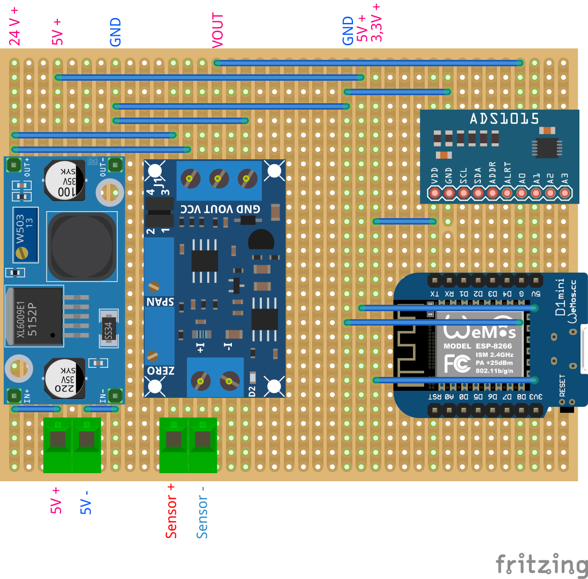
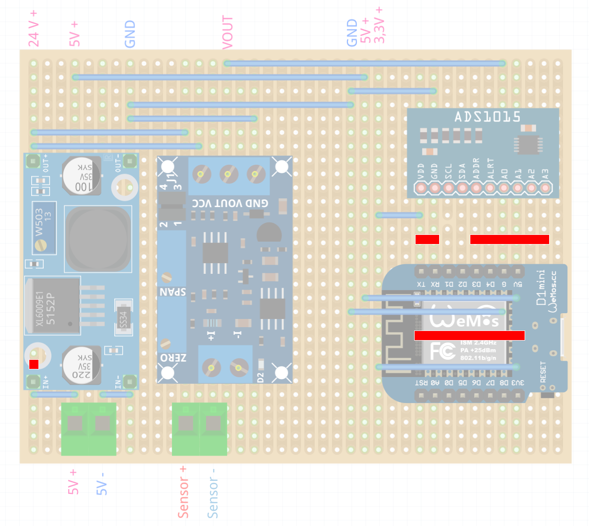

# Water Tank Monitor (D1 Mini / ESP8266)

ESP8266-basierter Wasserstand-Monitor für den Longzhuo TL-136 Flüssigkeitsstand-Messumformer (4-20 mA, 12-32 VDC).
Liest den Tankfüllstand über einen ADS1115 (I2C) aus und veröffentlicht Füllstand, Höhe, Volumen und Diagnosewerte per MQTT
(z. B. für ioBroker). WiFi-Konnektivität und OTA-Updates sind eingebaut.

## Inhaltsverzeichnis
- [Hardware](#hardware)
- [Verdrahtung](#verdrahtung)
- [Funktionsprinzip 4-20 mA](#funktionsprinzip-4-20-ma)
- [Projektstruktur](#projektstruktur)
- [Konfiguration](#konfiguration)
- [Build und Upload](#build-und-upload)
- [MQTT](#mqtt)
- [Serial-Ausgabe](#serial-ausgabe)
- [Fehlersuche](#fehlersuche)
- [OTA-Updates](#ota-updates)
- [Security](#security)
- [Tests und CI](#tests-und-ci)

---

## Hardware

| Bauteil | Beschreibung |
|---|---|
| WeMos D1 Mini | ESP8266-Mikrocontroller, 3,3 V Logik |
| Longzhuo TL-136 | 2-Draht 4-20 mA Füllstandssensor, 12-32 VDC Loop-Speisung |
| Boost-Converter | 5 V USB → 24 V DC für den Sensor-Loop (Trimmer auf 24 V einstellen) |
| 4-20 mA Empfänger | Wandelt Stromsignal in Spannung: I+ / I– Eingang, 0–3,3 V Ausgang |
| ADS1115 | 16-Bit I²C ADC (Adafruit), I²C-Adresse 0x48 (ADDR → GND), GAIN_ONE ±4,096 V |

> **Auflösung:** ADS1115 liefert 0,125 mV/Bit (16-Bit) statt 3,2 mV/Bit des ESP8266-internen ADC — 25× besser.  
> **Kein separates Netzteil nötig:** Der Boost-Converter erzeugt die 24 V Loop-Spannung direkt aus USB 5 V.

---

## Platinenlayout / Verdrahtung

Bestückung und Brücken



Trennungsstellen der Leiterbahnen (Cut-Lines) auf der Platine



### Klemmbelegung Schritt für Schritt

| Schritt | Von | Nach | Beschreibung |
|---|---|---|---|
| 1 | D1 Mini **5V-Pin** | Boost-Converter IN+ | 5V vom USB-VBUS (Polyfuse 500 mA, passt) |
| 2 | Boost-Converter OUT+ (24 V) | TL-136 Braun (+) | Loop-Spannung |
| 3 | TL-136 Blau (–) | Empfänger I+ | 4-20 mA Signal |
| 4 | Empfänger I– | GND-Schiene | Loop-Rückleitung |
| 5 | Empfänger Vout | ADS1115 **A0** | Spannungssignal 0–3,3 V |
| 6 | ADS1115 **SCL** | D1 Mini **D1** | I²C Takt |
| 7 | ADS1115 **SDA** | D1 Mini **D2** | I²C Daten |
| 8 | ADS1115 **VDD** | D1 Mini **3V3** | ADS1115 Versorgung |
| 9 | ADS1115 **ADDR** | GND-Schiene | I²C-Adresse 0x48 |
| 10 | D1 Mini **GND** | GND-Schiene | Gemeinsame Masse |
| 11 | USB-Kabel | D1 Mini (Micro-USB) | Einzige externe Stromquelle |

> **GND-Schiene:** Boost-Converter-GND, Empfänger-GND, ADS1115-GND und D1-Mini-GND müssen alle verbunden sein.  
> **Strombudget:** ESP8266 ~170 mA + Boost ~57 mA + Rest ~6 mA = ~230 mA gesamt — USB 2.0 (500 mA) hat ausreichend Reserve.

### Kalibrierung des Signalempfängers

Der 4-20 mA Empfänger hat zwei Trimmer: **ZERO** (Nullpunkt) und **SPAN** (Vollausschlag).
Ziel: 4 mA → 0,00 V, 20 mA → SPAN-Trimmer auf Maximum drehen und gemessenen Wert in `config.h` eintragen (dieser Receiver: **3,153 V**).

#### Schritt 1 – ZERO einstellen (Nullpunkt, leerer Tank)

> **Wichtig:** ZERO kalibriert den **4 mA-Punkt**. Ohne Sensor oder Widerstand-Simulator fließt kein Strom im Loop — der Trimmer lässt sich dann nicht sinnvoll einstellen.

- Multimeter (DC-Spannung) zwischen **VOUT** und **GND** der Receiver-Platine klemmen
- Tank leeren (Sensor angeschlossen) **oder** Widerstand-Simulator für 4 mA an **I+** / **I–** anschließen (s. u.)
- **ZERO-Trimmer** drehen bis Spannung an **VOUT** = **0,00 V**
- Drehrichtung: **Uhrzeigersinn erhöht** die Ausgangsspannung (bei den meisten Modulen) —  
  kurze Probedrehung machen und Multimeter beobachten; bei falschem Effekt Richtung umkehren

#### Schritt 2 – SPAN einstellen (Vollausschlag, voller Tank)

- Tank füllen **oder** 20 mA in **I+** / **I–** einspeisen (Widerstand-Simulator, s. u.)
- **SPAN-Trimmer** drehen bis Spannung an **VOUT** = **3,30 V**
- Drehrichtung: ebenfalls **Uhrzeigersinn erhöht** — kurze Probedrehung zur Verifikation

#### Schritt 3 – Iterieren

ZERO und SPAN beeinflussen sich gegenseitig leicht.  
Schritte 1 und 2 zwei- bis dreimal wiederholen bis beide Punkte stabil sind.

#### Trimmer und Potentiometer prüfen (vor dem Einbau)

Vor der Kalibrierung sicherstellen, dass Trimmer und Poti (für Simulator-Schaltung) intakt sind:

1. **Gesamtwiderstand messen** — Multimeter auf Ω, die beiden äußeren Anschlüsse messen:  
   Soll = Aufdruck (z. B. 5 kΩ, 10 kΩ). Abweichung > 20 % → Bauteil defekt.

2. **Schleifer auf Gleichmäßigkeit prüfen** — Multimeter auf Ω zwischen Schleifer (Mittelanschluss) und einem äußeren Anschluss, Trimmer/Poti langsam von Anschlag zu Anschlag drehen:  
   Wert soll sich **kontinuierlich und gleichmäßig** ändern (0 Ω bis Maximalwert).  
   Sprünge oder tote Bereiche → Bauteil verbraucht oder oxidiert → tauschen.

3. **Auf Unterbrechung testen** — Multimeter auf Durchgang (Piepton-Modus), Schleifer auf Mitte stellen, alle drei Anschlüsse paarweise prüfen: jedes Paar sollte Durchgang haben.

#### 4 mA und 20 mA simulieren ohne Tank

TL-136 abstecken, Widerstand in den Loop schalten:

```
Boost OUT+ (24 V) → [R_sim] → Multimeter (mA) → I+  [Receiver]  I– → GND
```

```
I = U / R    →    R = U / I

4 mA  (ZERO): R = 24 V / 4 mA  = 6000 Ω  → 5,6 kΩ + 390 Ω in Reihe
20 mA (SPAN): R = 24 V / 20 mA = 1200 Ω  → 1 kΩ + 200 Ω in Reihe

Achtung: 560 Ω wären bei 24 V ≈ 42 mA → Receiver-Schaden!
```

Multimeter in Reihe (Strommessung) ist die präziseste Methode — Widerstandstoleranzen ausgleichen durch Iterieren.

#### Hinweis: ZERO-Drift bei 24 V

Bei 24 V Loop-Spannung kann der ZERO-Punkt leicht über 0 V liegen.  
Liegt **VOUT** bei leerem Tank z. B. auf 0,05 V statt 0,00 V,  
den ZERO-Trimmer so weit wie möglich gegen 0 V trimmen — der Rest wird durch die **Software-Kalibrierung** (s. u.) korrigiert.

---

## Funktionsprinzip 4-20 mA

Der TL-136 ist ein **2-Draht Loop-Transmitter**: Er moduliert den Strom im
Loop proportional zum Füllstand. Der **4-20 mA Signalempfänger** wandelt
diesen Strom in eine Spannung um, die der ESP8266-ADC (A0, 10 Bit, 0–3,3 V) misst.

| Füllstand | Loop-Strom | Spannung an A0 (kalibriert) | ADC-Wert (0–1023) |
|---|---|---|---|
| 0 % | 4 mA | 0,00 V | 0 |
| 25 % | 8 mA | 0,83 V | ~256 |
| 50 % | 12 mA | 1,65 V | ~512 |
| 75 % | 16 mA | 2,48 V | ~768 |
| 100 % | 20 mA | 3,30 V | ~1023 |

**Formel:**

```
Spannung  = (ADC / 1023) × 3,3 V
Füllstand = (Spannung / 3,3 V) × 100   [%]
I_äquiv   = (Füllstand / 100) × 16 + 4  [mA]  ← nur für Logging/Validierung
```

Werte außerhalb 3,8–20,5 mA (äquivalent) werden als Sensor-/Verdrahtungsfehler geloggt.

---

## Projektstruktur

```text
water-tank-monitor/
├── src/
│   ├── app/
│   │   ├── application.cpp / .h    # Hauptschleife: Timer, Publizieren, MQTT-Befehle
│   │   └── main.cpp                # Objekte anlegen, setup()/loop()
│   ├── config/
│   │   ├── config.h                # Konstanten: Topics, Timings, Sensor, Tankgeometrie, Kalibriertabelle
│   │   └── systemconfig.h          # Zur Laufzeit per MQTT änderbare Werte
│   ├── domain/                     # Reine Logik ohne Arduino, nativ getestet
│   │   ├── tankmodel.cpp / .h      # Spannung → Strom, Höhe, Prozent, Volumen, Überlauf
│   │   ├── tanklevel.h             # Wertobjekt eines Messwerts
│   │   ├── mqttcommands.cpp / .h   # Payload-Parser für Intervall und 0/1
│   │   ├── intervaltimer.h         # millis()-überlaufsicherer Intervall-Timer
│   │   └── reconnectpolicy.h       # WLAN-Backoff
│   └── infrastructure/             # Hardware und Netzwerk
│       ├── levelsensor.cpp / .h    # ADS1115 auslesen
│       ├── wifimanager.cpp / .h    # WLAN verbinden, Reconnect mit Backoff
│       ├── mqttmanager.cpp / .h    # MQTT folgt dem WLAN-Zustand, LWT, Re-Subscribe
│       ├── otamanager.cpp / .h     # ArduinoOTA, fail-closed ohne Passwort
│       ├── watchdog.cpp / .h       # Software-Watchdog
│       └── trace.cpp / .h          # Serial-Logging
├── test/native/                    # Unity-Tests für src/domain
├── scripts/
├── platformio.ini
└── README.md
```

Externe Secrets (nicht im Repo):
```text
../_secrets/
├── WifiSecret.h        # WIFI_SSID, WIFI_PWD
├── MqttSecret.h        # MQTT_USER, MQTT_PWD
├── OtaSecret.h         # OTA_PASSWORD
└── last_ota_ip.txt     # zuletzt verwendete OTA-IP (automatisch)
../_config/
└── MqttConfig.h        # MQTT_SERVER_IP, MQTT_SERVER_PORT
```
Anlegen mit `scripts/setup_secrets.ps1` bzw. `scripts/setup_secrets.sh`.

---

## Konfiguration

Alle Konstanten liegen in [src/config/config.h](src/config/config.h).

### Sensor-Parameter

```cpp
constexpr uint8_t  SENSOR_ADS_I2C_ADDR      = 0x48;   // ADDR-Pin → GND
constexpr uint8_t  SENSOR_ADS_CHANNEL       = 0;      // ADS1115 Kanal A0
constexpr float    SENSOR_VREF              = 3.153f; // gemessener Vollausschlag des Empfängers (20 mA) [V]
constexpr uint32_t SENSOR_READ_INTERVAL_MS  = 500;    // Standard-Leseintervall, per MQTT änderbar
constexpr uint32_t MQTT_PUBLISH_INTERVAL_MS = 1000;   // Standard-Sendeintervall, per MQTT änderbar
```

`SENSOR_VREF` wird nur für den Stromwert (`currentMa`) und die Gültigkeitsprüfung (3,8–20,5 mA) verwendet.
Voraussetzung: Der Signalempfänger ist auf **4 mA → 0 V** kalibriert (ZERO/SPAN-Trimmer, s. Abschnitt
[Kalibrierung des Signalempfängers](#kalibrierung-des-signalempfängers)).

### Software-Kalibrierung (Kalibriertabelle)

Die Wasserhöhe wird über die Tabelle `SENSOR_CAL_TABLE` in `config.h` aus der Spannung berechnet: zwischen zwei Punkten
linear interpoliert, unterhalb des ersten Punkts auf die Sensorhöhe begrenzt, oberhalb des letzten mit der Steigung des
letzten Abschnitts extrapoliert. Höhe ist die gesamte Wasserhöhe ab Tankboden (wie mit dem Maßband gemessen).

```cpp
constexpr SensorCalPoint SENSOR_CAL_TABLE[] = {
    { 0.000f,  13.0f },   // Sensorposition
    { 0.2277f, 20.0f },   // gemessen
    { 2.2419f, 210.0f },  // gemessen
    ...
};
```

**Neuen Messpunkt aufnehmen:**

1. Kalibriermodus einschalten: `1` auf `water-tank-monitor/config/calibrationMode/set` (Werte alle 500 ms)
2. Wasserhöhe mit dem Maßband messen
3. Spannung aus `water-tank-monitor/tank/voltageV` ablesen
4. Punkt `{ Spannung, Höhe }` in `SENSOR_CAL_TABLE` einfügen (Spannungen aufsteigend sortiert)
5. `pio test -e native` ausführen (prüft u. a. alle Tabellenpunkte), Firmware bauen und flashen
6. Kalibriermodus ausschalten: `0` auf `.../calibrationMode/set`

### Libraries

Versionen sind in `platformio.ini` exakt festgelegt (Adafruit ADS1X15, Adafruit BusIO, PubSubClient) und werden
automatisch über PlatformIO installiert.

### WiFi Credentials

Datei: `../_secrets/WifiSecret.h`
```cpp
#define WIFI_SSID "DEIN_NETZWERK"
#define WIFI_PWD  "DEIN_PASSWORT"
```

### OTA-Passwort

Datei: `../_secrets/OtaSecret.h`
```cpp
#define OTA_PASSWORD "dein_ota_passwort"
```

OTA ist **fail-closed**: ohne gesetztes Passwort und
`OTA_ALLOW_INSECURE_NO_PASSWORD false` bleibt OTA deaktiviert.

---

## Build und Upload

### USB (erstmaliger Flash)

```powershell
pio run -e d1-mini-usb
pio run -e d1-mini-usb -t upload -t monitor --upload-port COM3
```

### OTA (Folge-Updates)

Interaktives PowerShell-Skript (fragt IP ab, liest OTA-Passwort automatisch):

```powershell
.\scripts\upload_ota.ps1
```

Alternativ (Windows Batch):
```bat
scripts\upload_ota.bat
```

Die zuletzt verwendete IP wird in `../_secrets/last_ota_ip.txt` gespeichert.

---

## MQTT

Alle Topics beginnen mit `water-tank-monitor/`. Werte veröffentlicht das Gerät retained, außer `system/rssi`.

| Topic | Inhalt |
|---|---|
| `tank/levelPercent`, `tank/heightCm`, `tank/volumeLiters`, `tank/volumeOverflowLiters` | Messwerte (nur bei gültigem Sensorwert) |
| `tank/currentMa`, `tank/voltageV`, `tank/valid` | Rohwerte und Gültigkeit (`true`/`false`) |
| `system/health` | JSON mit Sensor-, WLAN-, Heap- und OTA-Status |
| `system/ip`, `system/rssi` | IP-Adresse, WLAN-Signalstärke |
| `system/status` | `online`, bzw. `offline` als Last Will |
| `config/readIntervalMs`, `config/publishIntervalMs`, `config/calibrationMode` | aktuelle Einstellungen |

Befehle (auf das jeweilige Topic schreiben):

| Topic | Gültige Werte |
|---|---|
| `config/readIntervalMs/set`, `config/publishIntervalMs/set` | nur Ziffern, ohne führende Null, ab 500 (ms); sehr große Werte (bis 4294967295) setzen Lesen bzw. Senden praktisch aus |
| `config/calibrationMode/set` | `1` (Lesen und Senden alle 500 ms) oder `0` |
| `command/reset` | `1` startet das Gerät neu, alles andere wird ignoriert |

Ungültige Werte werden ignoriert und im Serial-Log als Warnung gemeldet. Frühere Firmware-Versionen haben z. B. `12abc`
als 12 ms übernommen, Werte unter 500 ms akzeptiert und den Rohtext ins State-Topic zurückgeschrieben.

---

## Serial-Ausgabe

Baud: **115200**

```
[INFO] Application setup started
[INFO] ADS1115 ready
[INFO] MqttManager setup complete
[INFO] Application setup complete
[INFO] WiFi connected, IP: 192.168.178.42
[INFO] Setting up OTA...
[INFO] OTA initialized successfully
[INFO] MQTT connecting...
[INFO] MQTT connected
[INFO] MQTT connected - publishing initial values
[INFO] Tank: 47.3% | 106.1 cm | 3333 L | 11.57 mA
[WARNING] Sensor out of range: 0.00 mA - check wiring    ← Kabel offen oder Kurzschluss
```

---

## Fehlersuche

### Messpunkte & Sollwerte

Alle Spannungen gegen GND-Schiene. Multimeter DC-Volt, Loop-Strom in Reihe.

| Messpunkt | Instrument | Sollwert |
| --- | --- | --- |
| Boost OUT+ | Multimeter | **24 V ±0,5 V** |
| Loop-Strom (in Reihe) | Multimeter mA | **4–20 mA** |
| Receiver **VOUT** | Multimeter | **0,00–3,30 V** (proportional zum Füllstand) |
| ADS1115 A0 | Multimeter | identisch mit Receiver **VOUT** |
| ADS1115 VDD | Multimeter | **3,30 V ±0,1 V** |
| ADS1115 ADDR | Multimeter | **0 V** (→ I²C-Adresse 0x48) |
| I²C SCL (D1 Mini D1) | Oszi | **100 kHz** Takt, aktiv beim Lesen |
| I²C SDA (D1 Mini D2) | Oszi | Datenpulse synchron mit SCL |
| Boost OUT+ Ripple | Oszi AC-Kopplung | **< 200 mV pp** |

---

### Fehlerbild: `[WARNING] Sensor out of range – check wiring`

Tritt auf wenn `currentMa < 3,8` oder `currentMa > 20,5`. Schritt für Schritt eingrenzen:

```
1. Boost-Converter prüfen
   → Multimeter an OUT+ vs GND
   → < 20 V?  → Trimmer nachstellen oder Boost defekt
   → 0 V?     → D1 Mini 5V-Pin prüfen (USB-Verbindung, Polyfuse)

2. Loop-Strom prüfen
   → Multimeter (mA) in Serie: TL-136(–) Blau → Receiver I+
   → 0 mA?    → Offener Kreis: Kabel gebrochen oder TL-136 defekt
   → > 21 mA? → TL-136 übersteuert oder Kurzschluss im Loop
   → 4–20 mA? → Loop OK → weiter mit Schritt 3

3. Receiver-Ausgang prüfen
   → Multimeter (DC-V) an VOUT vs GND der Receiver-Platine
   → 4 mA im Loop → VOUT sollte ~0,0 V sein
   → 20 mA im Loop → VOUT sollte ~3,3 V sein
   → Abweichung → ZERO/SPAN-Trimmer nachjustieren (siehe Kalibrierung)

4. ADS1115-Versorgung prüfen
   → VDD = 3,3 V?
   → ADDR = 0 V? (I²C-Adresse 0x48)
   → GND mit D1 Mini GND verbunden?

5. I²C-Bus prüfen
   → Oszi an SCL (D1) und SDA (D2), Trigger: fallende Flanke SCL
   → Kein Signal → Kabel unterbrochen oder ADS1115 defekt
   → Signal vorhanden → I²C läuft, Firmware-Problem unwahrscheinlich
```

---

### Fehlerbild: Wert springt oder ist verrauscht

**Boost-Ripple (Oszi, AC-Kopplung, 50 mV/div, 20 µs/div):**

- Ripple > 500 mV pp → 100 µF / 25 V Elko direkt an Boost OUT+/GND nachrüsten
- Spitzen synchron mit WiFi-Bursts (alle ~100 ms) → zusätzlich 100 µF an D1 Mini 5V/GND

**I²C-Signalqualität (Oszi, 2 V/div, 5 µs/div):**

- Flanken stark abgerundet → Pull-up-Widerstand fehlt oder zu groß → 4,7 kΩ von SCL/SDA nach 3,3 V
- Idealbild: steile Rechteckflanken, 100 kHz, High-Pegel ~3,3 V

---

### Fehlerbild: Angezeigter %-Wert weicht vom tatsächlichen Füllstand ab

Kalibrierungstabelle in `src/config/config.h` ergänzen:

1. Loop-Strom mit Multimeter auf einen bekannten Wert einstellen (z. B. 12 mA = 50 %)
2. Receiver **VOUT** messen → dieser Spannungswert ist der neue Tabellenpunkt
3. Tatsächliche Gesamthöhe ab Tankboden (Maßband) notieren
4. Eintrag in `SENSOR_CAL_TABLE` hinzufügen: `{ gemessene_V, tatsächliche_Höhe_cm }`
5. Firmware neu bauen und flashen

Mehr Stützpunkte = genauere Kurve. Punkte müssen aufsteigend nach Spannung sortiert sein.

---

### TL-136 ohne Wasser simulieren (Widerstands-Methode)

TL-136 abstecken, Widerstand + Multimeter (mA) in Reihe in den Loop einsetzen:

```
Boost OUT+ (24 V) → [R_sim] → Multimeter (mA) → Receiver I+ → Receiver I– → GND
```

| Simulation | Strom | R_gesamt | Praktischer Wert |
| --- | --- | --- | --- |
| Leerer Tank (ZERO) | 4 mA | 6000 Ω | 5,6 kΩ + 390 Ω |
| Halbvoll | 12 mA | 2000 Ω | 1,8 kΩ + 180 Ω |
| Voller Tank (SPAN) | 20 mA | 1200 Ω | 1 kΩ + 180 Ω |

> Widerstandswert immer mit Multimeter (mA in Reihe) verifizieren — Receiver-Innenwidertand (~150–250 Ω) ist bereits eingerechnet.  
> **Achtung:** 560 Ω wären bei 24 V ≈ 42 mA → Receiver-Schaden.

---

### Schnell-Checkliste

```
□ Boost OUT+ = 24 V DC
□ Loop-Strom mit angeschlossenem Sensor: 4–20 mA
□ Receiver VOUT bei 4 mA  → 0,00 V (ZERO-Trimmer)
□ Receiver VOUT bei 20 mA → 3,153 V (SPAN-Trimmer Maximum, gemessen)
□ ADS1115 VDD = 3,30 V
□ ADS1115 ADDR = 0 V (Adresse 0x48)
□ I²C SCL aktiv beim Lesen (Oszi)
□ Boost-Ripple < 200 mV pp (Oszi, AC-Kopplung)
□ Serial: kein [WARNING] bei korrektem Loop-Strom
```

---

## OTA-Updates

Skript `scripts/upload_ota.ps1`:
- Liest `OTA_PASSWORD` direkt aus `../_secrets/OtaSecret.h`
- Fragt die Geräte-IP ab (letzter Wert als Vorschlag)
- Startet `pio run -e d1-mini-ota -t upload --upload-port <IP>`

---

## Security

- OTA nur in vertrauenswürdigen Netzen aktivieren
- Keine Secrets ins Repository committen
- `OTA_PASSWORD` immer setzen (`OTA_ALLOW_INSECURE_NO_PASSWORD false`)
- Bei WLAN-Ausfall: automatischer Reconnect mit Backoff + Jitter

---

## Tests und CI

```powershell
pio run -e d1-mini-usb          # Firmware-Build
pio test -e native              # Unit-Tests (benötigt gcc/g++ lokal)
```

Die Unit-Tests kompilieren den echten Code aus `src/domain/` für den PC (`test_build_src = yes`):
Kalibrierung und Tankgeometrie, MQTT-Payload-Parser, Intervall-Timer und WLAN-Backoff.
Unter Windows liefert z. B. `winget install BrechtSanders.WinLibs.POSIX.UCRT` den nötigen gcc/g++.

CI-Workflow: `.github/workflows/ci.yml` (Firmware-Build und Unit-Tests bei Push auf `main` und bei Pull Requests auf `main`)

### Build-Cache leeren

```powershell
Remove-Item -Recurse -Force .pio\build
```

---

## Referenzen

- [Arduino Core für ESP8266](https://github.com/esp8266/Arduino)
- [ArduinoOTA (ESP8266)](https://arduino-esp8266.readthedocs.io/en/latest/ota_updates/readme.html)
- [PlatformIO](https://platformio.org)
- [WeMos D1 Mini Pinout](https://www.wemos.cc/en/latest/d1/d1_mini.html)
